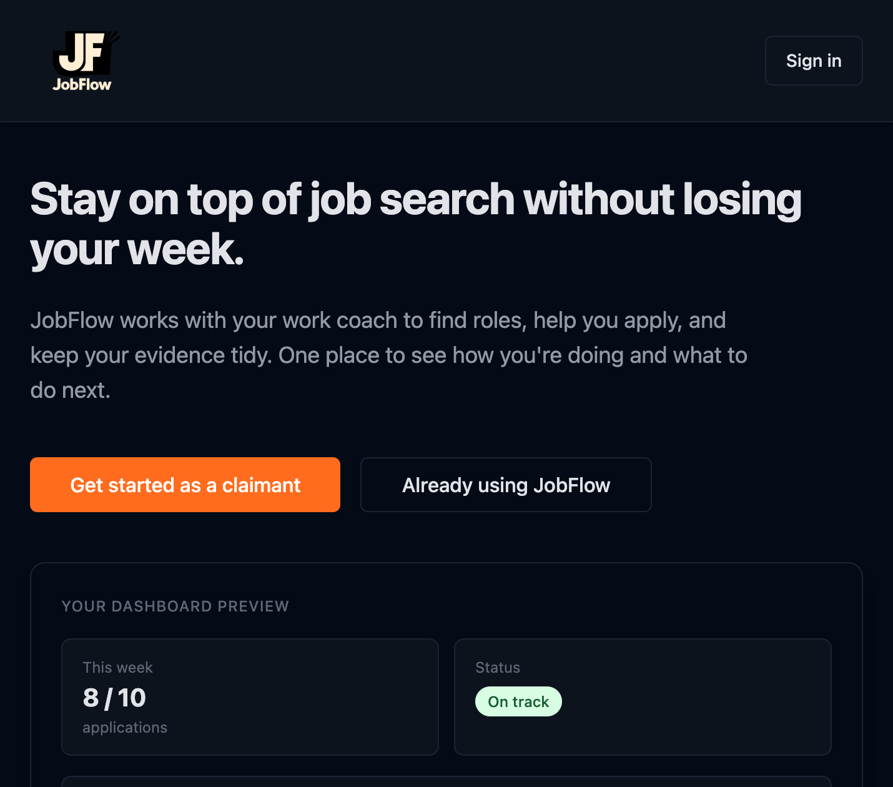
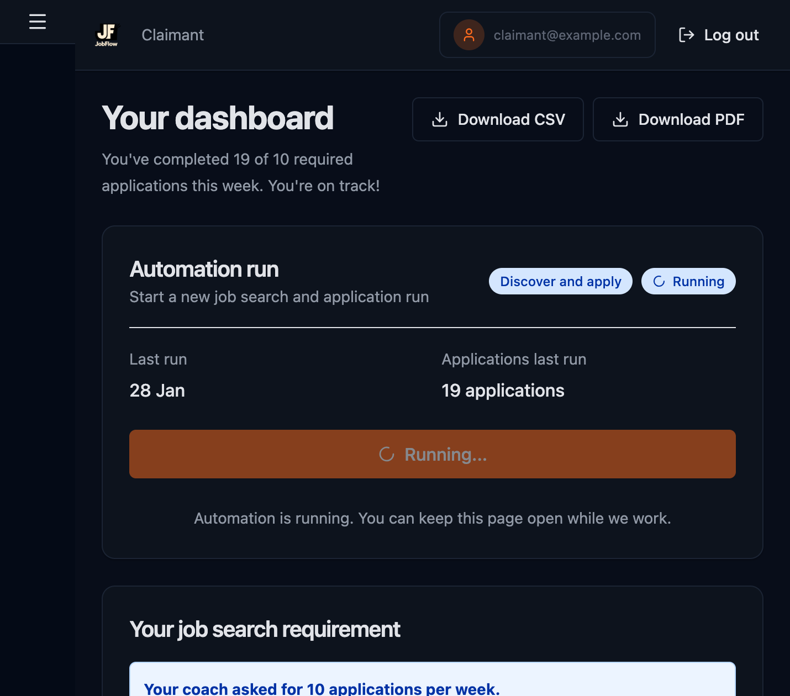
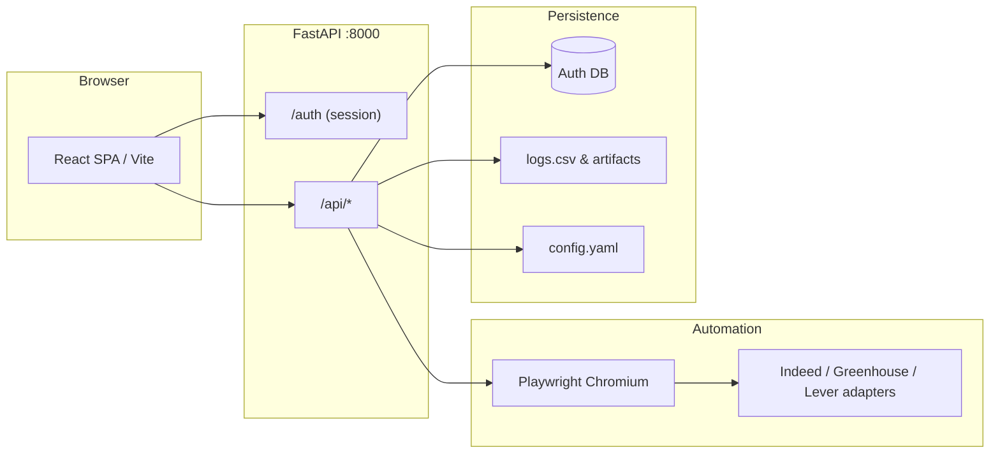

# JobFlow (AutoApplyer)

[](https://github.com/HarryRobertL/JOB-flow/actions/workflows/ci.yml)

**Repository:** [github.com/HarryRobertL/JOB-flow](https://github.com/HarryRobertL/JOB-flow)

A claimant-facing job search assistant that uses Playwright to drive a browser and automatically apply to suitable jobs on sites like Indeed, Greenhouse, and Lever. Designed for UK DWP claimants as a pilot-ready application that can run daily with minimal supervision and produces structured logs for work coach dashboards.

## Live demo

After you deploy the static SPA (for example [Netlify](https://netlify.com) via [`netlify.toml`](netlify.toml)) and the FastAPI backend (see [`DEPLOYMENT.md`](DEPLOYMENT.md)), add the public URL here so reviewers can try the app—for example `https://<your-site>.netlify.app`.

## Screenshots

Add PNG or WebP images under [`docs/screenshots/`](docs/screenshots/) and link them here. Example markdown once files exist:

```markdown


```

## System architecture



For file-level detail and data flows, see [`ARCHITECTURE_OVERVIEW.md`](ARCHITECTURE_OVERVIEW.md).

## Tech stack

| Layer | Stack |
|--------|--------|
| **Claimant / staff UI** | React 18, TypeScript, Vite, React Router, Tailwind CSS |
| **Testing (frontend)** | Vitest, Testing Library, jsdom |
| **API & server** | Python 3.10+, FastAPI, Uvicorn, Pydantic |
| **Data** | SQLAlchemy, Alembic, SQLite or Postgres (see deployment docs) |
| **Automation** | Playwright (Chromium), platform adapters in `autoapply/adapters/` |
| **Static hosting** | Netlify-ready SPA build (`npm run build` → `dist/`) |

## Environment variables

- **Frontend:** copy [`.env.example`](.env.example) to `.env.local` and set `VITE_API_BASE_URL` only if the API is not same-origin (local dev usually uses the Vite proxy in [`vite.config.ts`](vite.config.ts)).
- **Engine:** use `config.example.yaml` → `config.yaml` (gitignored). Never commit real credentials.

## Local development (full stack)

**Terminal 1 — backend**

```bash
python -m venv .venv
source .venv/bin/activate   # Windows: .venv\Scripts\activate
pip install -e ".[dev]"
playwright install chromium
cp config.example.yaml config.yaml
# edit config.yaml; ensure data/ and profiles/ are writable
uvicorn autoapply.server:app --reload --port 8000
```

**Terminal 2 — frontend**

```bash
npm ci
cp .env.example .env.local   # optional
npm run dev
```

Open the URL Vite prints (typically `http://localhost:5173`). API routes under `/api` and `/auth` proxy to `http://localhost:8000` by default.

```bash
npm test          # Vitest
npm run build     # production bundle
```

## Author & contribution

**Harry Robert Lovell** — primary author of this repository: Playwright-based apply engine and adapters, FastAPI service (auth, APIs, health checks), React claimant and work-coach experiences (onboarding, dashboards, compliance-oriented UI), frontend test setup (Vitest), CI workflow, deployment notes, and documentation structure. Third-party libraries are used per `package.json` and `pyproject.toml`.

## Features

- **Automated Job Applications**: Automatically applies to jobs on Indeed (Easy Apply), Greenhouse, and Lever. **Workday** support is experimental (see [Configuration](#configuration)).
- **Persistent Browser Profile**: Uses a persistent Playwright browser profile so credentials are never stored in config files
- **Structured Logging**: Produces CSV logs and artifacts for work coach dashboards
- **Configurable Filters**: Filter jobs by title and keywords
- **Rate Limiting**: Configurable daily caps and random delays to keep sessions human-like

## Installation

### Prerequisites

- Python 3.10 or higher
- Playwright browsers (installed automatically)

### Setup

1. Clone or download this repository

2. Install the package in editable mode:

```bash
pip install -e .
```

3. Install Playwright browsers:

```bash
playwright install chromium
```

4. Create your configuration file:

```bash
cp config.example.yaml config.yaml
```

5. Edit `config.yaml` with your account information, CV path, and job search preferences

## Usage

### Web UI (Recommended for Claimants)

The easiest way to use AutoApplyer is through the web interface:

1. Start the web server:

```bash
autoapply-ui
```

Or run directly:

```bash
python -m autoapply.server
```

2. Open your browser and navigate to:

```
http://localhost:8000
```

3. Click "Configure Profile & Searches" to set up:
   - Your account information (email, name, phone, location)
   - Paths to your CV and cover letter template
   - Job search preferences (query, location, radius, etc.)

4. Click "Start New Run" from the status page to begin applying to jobs

The web interface provides a simple form-based setup and shows real-time statistics from your application runs.

### Command Line Interface

For advanced users, you can also run AutoApplyer from the command line:

```bash
autoapply --config config.yaml
```

Or with a headless browser:

```bash
autoapply --config config.yaml --headless
```

### First Run

On the first run, AutoApplyer will:
1. Open a browser window
2. Navigate to Indeed
3. Prompt you to sign in manually (credentials are never stored)
4. Wait for you to complete any Cloudflare verification
5. Begin applying to jobs based on your configuration

The browser profile is saved locally, so you only need to sign in once. Subsequent runs will use the saved session.

**Note:** When using the web UI, the browser window will open automatically when you start a run. Make sure to complete the sign-in process in that window.

## Configuration

The `config.yaml` file contains several sections:

### Account Information

```yaml
account:
  email: "user@example.com"
  first_name: "Harry"
  last_name: "Lovell"
  phone: "+44..."
  location: "Cardiff, UK"
```

### Default Files

```yaml
defaults:
  cv_path: "/path/to/cv.pdf"
  cover_letter_template: "/path/to/cover_letter_template.md"
```

### Job Searches

```yaml
searches:
  - name: "retail_assistant_cardiff"
    platform: "indeed"
    query: "Retail assistant"
    location: "Cardiff"
    radius_km: 25
    easy_apply: true
```

### Workday (experimental)

Workday job boards are supported experimentally. Use `platform: "workday"` and set `workday_base_url` to the full job board URL (e.g. `https://<tenant>.wd1.myworkdayjobs.com/en-US/Careers`). Add a search entry as in `config.example.yaml`. Behaviour may vary by tenant; selectors can require tuning.

### Limits and Filters

```yaml
limits:
  daily_apply_cap: 60
  per_site_cap: 40
  pause_between_apps_seconds: [6, 18]

filters:
  titles_include:
    - "Retail assistant"
  keywords_include:
    - "customer service"
```

See `config.example.yaml` for a complete example.

## Project Structure

```
├── src/                 # React SPA (Vite) — claimant & staff UI
├── autoapply/           # Python package — FastAPI app, CLI, engine
├── tests/               # pytest (API, engine, adapters)
├── ui/                  # Legacy Jinja templates (optional paths)
├── docs/                # Additional documentation & screenshot assets
├── public/              # PWA icons, manifest, service worker
├── package.json         # Frontend dependencies & scripts
├── vite.config.ts
├── vitest.config.ts
├── pyproject.toml
├── config.example.yaml
└── README.md
```

## Important Notes

### Environment Cleanup

This repository intentionally does **not** store:
- `.venv/` - Virtual environments should be created locally
- `profiles/` - Playwright browser profiles (created at runtime)
- `data/` - Logs and artifacts (created at runtime)

If you have existing `.venv` or `profiles` folders from a previous setup, delete them locally and recreate a fresh environment:

```bash
# Remove old environment
rm -rf .venv profiles

# Create new virtual environment
python -m venv .venv
source .venv/bin/activate  # On Windows: .venv\Scripts\activate

# Install package
pip install -e .
```

### Security and Ethics

- **Terms of Service**: Automating job applications may violate some site terms of service. Use at your own risk.
- **Rate Limiting**: Always set conservative daily caps and random delays to keep sessions human-like.
- **Credentials**: Never commit your `config.yaml` file to version control. It's already in `.gitignore`.

### Future Development

This is a pilot-ready application. Future enhancements planned:
- Deeper work-coach analytics and exports
- Additional platform adapters (Ashby, SmartRecruiters) beyond experimental Workday
- Enhanced logging and observability for production operations

## Pilot Analytics

AutoApplyer includes an analytics module that processes application logs to produce per-week and per-site summaries suitable for DWP reporting.

### Running Analytics

To generate a summary of application activity:

```bash
python -m autoapply.analytics
```

This will:
- Load logs from `data/logs.csv`
- Group entries by ISO week (e.g., "2025-W46")
- Count applications by status (`applied`, `skip`, `error`) and by site (`indeed`, `greenhouse`, `lever`)
- Print a text summary to the console
- Export a flattened CSV to `data/summary.csv` for Excel import

The summary CSV includes one row per week and site combination, with columns for total applications and breakdowns by status.

### Technical Documentation

For DWP reviewers, a detailed technical note is available at [`docs/dwp_pilot_technical_note.md`](docs/dwp_pilot_technical_note.md). This document explains:

- How AutoApplyer operates at a technical level
- Which sites it interacts with (Indeed, Greenhouse, Lever)
- How the persistent browser profile works and why passwords are not stored
- What data is written to `data/logs.csv` and `data/artifacts/`
- What data is not stored (email content, rejection messages, etc.)
- How claimants can delete their data after the pilot
- Rate limiting and safeguards (daily caps, random delays)

## Development

### Running Tests

**Python (API & engine):**

```bash
pytest
```

**React (Vitest):**

```bash
npm test
```

To run **engine-related tests** only (config, caps, timeout, logging, adapters, storage):

```bash
pytest tests/test_config.py tests/test_caps_and_pause.py tests/test_logging.py tests/test_storage.py tests/test_adapter_smoke.py tests/adapters/ -v
```

Or run the full suite to include API, health-check, and adapter tests:

```bash
pytest -v
```

### Health check

The `GET /health` endpoint verifies **engine prerequisites** before a pilot run. Use it to confirm the engine is ready.

**Checks performed:**

| Check | Description |
|-------|-------------|
| `config` | `config.yaml` exists and loads successfully (valid YAML and schema). |
| `data_writable` | `data/` directory exists and is writable (logs, artifacts, run state). |
| `profiles` | `profiles/` directory exists or can be created (Playwright browser profile). |
| `playwright` | Playwright package is importable (run `playwright install chromium` if missing). |
| `database` | SQLite auth store is reachable. |

**Response shape:** `status` is `"healthy"` or `"degraded"`. When degraded, HTTP status is 503. The `engine` object contains one entry per check with `ok` (boolean) and `message` (string). Any `ok: false` entry indicates what to fix.

**DWP pilot:** Before starting a run, call `GET /health`. If `status` is `"healthy"` and all `engine.*.ok` values are true, the engine is ready. If degraded, inspect `engine.config`, `engine.data_writable`, `engine.profiles`, or `engine.playwright` and fix the reported issue (e.g. create `config.yaml` from `config.example.yaml`, ensure `data/` and `profiles/` exist and are writable, install Playwright browsers).

### Type Checking

```bash
mypy autoapply/
```

### Building

```bash
python -m build
```

## License

MIT License - see LICENSE file for details.

## Support

For issues, questions, or contributions, please open an issue on the repository.
